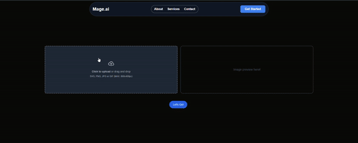

# MageAI - Image Upscaling with ESRGAN

[](LICENSE)

MageAI is an advanced image upscaling web application powered by the Enhanced Super-Resolution Generative Adversarial Networks (ESRGAN). This application allows users to upload low-resolution images and receive high-resolution upscaled versions, leveraging state-of-the-art AI techniques.

## Table of Contents
- [Overview](#overview)
- [Features](#features)
- [Technologies](#technologies)
- [Installation](#installation)
- [Usage](#usage)
- [Model Architecture](#model-architecture)
- [References](#references)

---

## Overview

MageAI is designed for image upscaling and enhancement, specifically aimed at restoring details from low-resolution images. It uses ESRGAN (Enhanced Super-Resolution GAN) to improve image quality significantly by learning how to add high-frequency details lost in low-resolution images.


ESRGAN has revolutionized image super-resolution by introducing Residual-in-Residual Dense Blocks (RRDB) and the Relativistic GAN framework. [Read more about ESRGAN here](https://arxiv.org/abs/1809.00219).

---

## Features

- **Upload**: Upload an image (supports PNG, JPG, SVG, GIF).
- **Upscale**: Uses ESRGAN for image upscaling.
- **Preview**: View the upscaled image instantly.
- **Download**: Download the upscaled image.

---

## Technologies

This project is built with:

- **Frontend**: [React](https://reactjs.org/) and [Next.js](https://nextjs.org/)
- **Styling**: [Tailwind CSS](https://tailwindcss.com/)
- **Backend**: [FastAPI](https://fastapi.tiangolo.com/) for handling image processing.
- **Machine Learning Model**: [ESRGAN](https://github.com/xinntao/ESRGAN) for image upscaling.
- **Image Handling**: Python's `PIL` library for image processing.
- **Deployment**: [Render](https://render.com/) for hosting both frontend and backend services.

---

## Installation

To run this project locally, follow the steps below:

### Prerequisites
- Node.js (>= 16.x.x)
- Python (>= 3.9)
- FastAPI
- [Install ESRGAN](https://github.com/xinntao/ESRGAN#installation)

### Clone the repository
```bash
git clone https://github.com/PranavBhatP/Mage.ai.git
cd Mage.ai
```

### Frontend Setup
1. Navigate to the `client/` folder:
    ```bash
    cd client
    ```

2. Install dependencies:
    ```bash
    npm install
    ```

3. Start the development server:
    ```bash
    npm run dev
    ```

### Backend Setup
1. Navigate to the `server/` folder:
    ```bash
    cd server
    ```

2. Install dependencies (preferably in a virtual environment):
    ```bash
    pip install -r requirements.txt
    ```

3. Run the FastAPI backend:
    ```bash
    uvicorn main:app --host 0.0.0.0 --port 8000
    ```

---

## Usage

1. **Upload an Image**: Upload your image (JPG, PNG, or GIF format).
2. **Upscale**: Click the "Let's Go!" button to process the image using the backend ESRGAN model.
3. **Download the Image**: Once processed, download your upscaled image.




---

## Model Architecture

The backbone of this project is **ESRGAN** which improves upon the classic GAN by using:

- **RRDB** (Residual-in-Residual Dense Block): Enables better learning and stability for high-res image generation.
- **Relativistic GAN**: Helps the model better differentiate between real and generated high-resolution images.
  
Learn more about the architecture in the original [ESRGAN paper](https://arxiv.org/abs/1809.00219).

---

## References

- ESRGAN GitHub: [https://github.com/xinntao/ESRGAN](https://github.com/xinntao/ESRGAN)
- Original ESRGAN Paper: [ESRGAN: Enhanced Super-Resolution Generative Adversarial Networks](https://arxiv.org/abs/1809.00219)
- FastAPI Documentation: [https://fastapi.tiangolo.com/](https://fastapi.tiangolo.com/)
- Next.js Documentation: [https://nextjs.org/docs](https://nextjs.org/docs)

---

## License

This project is licensed under the MIT License - see the [LICENSE](LICENSE) file for details.
```
